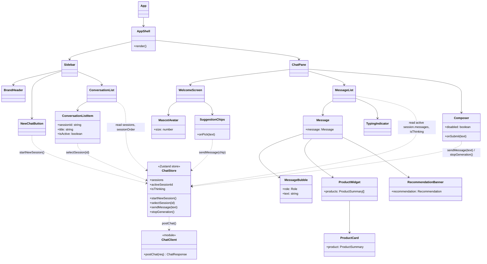
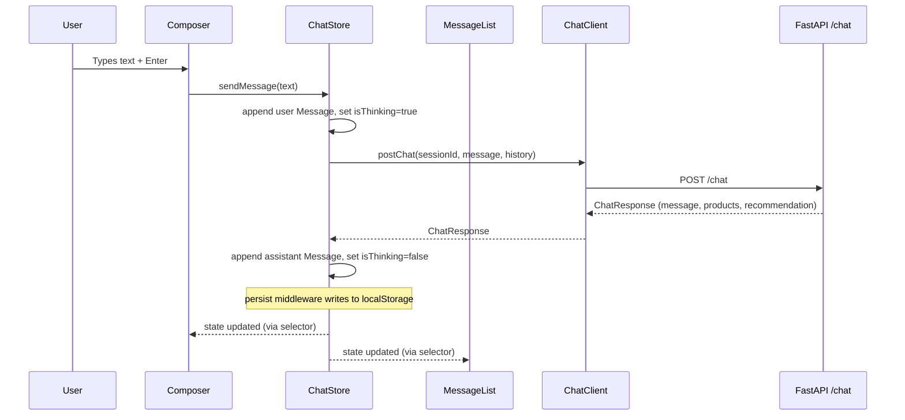

# Project Frontend Design — AI Shopping Copilot Client

## 1. Goals & Framing

The frontend is a **locally-runnable React single-page app** that talks to the server's `POST /chat` endpoint and renders the conversation, including rich product cards as in-chat widgets.

This design mirrors the three design samples in [.docs/design_samples/](../.docs/design_samples/):

- **`init_stage.png`** — welcome screen: mascot + greeting + suggestion chips + composer.
- **`tinking.png`** — the assistant's "thinking…" state between user message and response.
- **`widgtpng.png`** — the product widget inline in the chat (carousel of product cards with image, title, specs, price, "View product" CTA).

Two deliberate deviations from the samples per the brief:

1. **Language: English.** The samples are in Hebrew / RTL; our UI is LTR English.
2. **New brand palette + new mascot.** The sample is blue-on-white with a blue robot called *zapi*. We swap to a warm **emerald + cream** palette and a new mascot — **"Olive" the owl** (a friendly green owl with tiny glasses holding a shopping tag). Olive is different in species, posture, and color from the blue robot so the product is visually distinct.

---

## 2. Brand & Visual Design

### 2.1 Color tokens

| Token | Value | Usage |
|---|---|---|
| `--color-bg` | `#FAF7F2` | App background (warm cream) |
| `--color-surface` | `#FFFFFF` | Cards, composer, message bubbles |
| `--color-surface-muted` | `#F3EFE7` | Sidebar, hover states |
| `--color-primary` | `#059669` | Emerald — brand, primary buttons, active nav |
| `--color-primary-hover` | `#047857` | Button hover |
| `--color-primary-soft` | `#D1FAE5` | User message bubble background |
| `--color-accent` | `#F59E0B` | Amber — price highlight, "top pick" badge |
| `--color-text` | `#1F2937` | Primary text |
| `--color-text-muted` | `#6B7280` | Timestamps, helper text |
| `--color-border` | `#E5E7EB` | Card and composer borders |
| `--color-danger` | `#DC2626` | Error banners |

Dark mode is **out of scope** for v1 but all colors are declared as CSS variables in `theme/tokens.css` so a `[data-theme="dark"]` override can be added later without touching components.

### 2.2 Typography

- **Font:** `Inter` (self-hosted via `@fontsource/inter`) with system fallbacks.
- **Scale:** 12 / 14 / 16 / 18 / 20 / 24 px. Body 16 px / line-height 1.5.

### 2.3 Mascot — "Olive the Owl"

- A flat-illustrated emerald-feathered owl wearing small round amber glasses, holding a mini shopping tag.
- Single SVG asset at [client/src/assets/mascot.svg](../client/src/assets/mascot.svg).
- Appears on the welcome screen at ~220 px. Reused at 32 px next to assistant bubbles.

### 2.4 Layout

Desktop (≥ 1024 px):

```
┌──────────────────────────────────────────────┬──────────────────┐
│                                              │  BrandHeader     │
│                                              │  + New chat      │
│                ChatPane                      │  ───────────     │
│  (WelcomeScreen | MessageList + Composer)    │  ConversationList│
│                                              │                  │
└──────────────────────────────────────────────┴──────────────────┘
          flex: 1                                width: 280 px
```

Mobile (< 768 px): Sidebar collapses into a slide-over triggered from a hamburger in the top bar. ChatPane becomes full-width.

---

## 3. Technical Choices

| Layer | Choice | Why |
|---|---|---|
| Build tool | **Vite 5** | Fast local dev, matches the "runs locally" brief. |
| Framework | **React 18 + TypeScript** | Typed components, strict mode. |
| State | **Zustand** with `persist` middleware | See §4. |
| Styling | **Tailwind CSS** + CSS variable tokens | Utility-first for speed; tokens give one place to re-skin. |
| Routing | **None** — single screen | No need for react-router for one page. |
| HTTP | `fetch` in a thin client wrapper | No axios dependency needed for one endpoint. |
| IDs | **`uuid` v4** | `sessionId` and `messageId` generation. |
| Testing | **Vitest** + **React Testing Library** | Standard Vite pairing. |

### Folder layout (`client/src/`)

```
client/
├── package.json
├── vite.config.ts
├── tsconfig.json
├── index.html
├── tailwind.config.ts
└── src/
    ├── main.tsx
    ├── App.tsx
    ├── api/
    │   ├── chatClient.ts          # POST /chat wrapper (fetch + timeout + error mapping)
    │   └── types.ts               # Wire types mirroring server ChatRequest / ChatResponse
    ├── store/
    │   ├── chatStore.ts           # Zustand store + persist middleware
    │   └── types.ts               # Session, Message, Role
    ├── components/
    │   ├── AppShell.tsx
    │   ├── Sidebar/
    │   │   ├── Sidebar.tsx
    │   │   ├── BrandHeader.tsx
    │   │   ├── NewChatButton.tsx
    │   │   ├── ConversationList.tsx
    │   │   └── ConversationListItem.tsx
    │   └── Chat/
    │       ├── ChatPane.tsx
    │       ├── WelcomeScreen.tsx
    │       ├── MascotAvatar.tsx
    │       ├── SuggestionChips.tsx
    │       ├── MessageList.tsx
    │       ├── Message.tsx
    │       ├── MessageBubble.tsx
    │       ├── TypingIndicator.tsx
    │       ├── ProductWidget/
    │       │   ├── ProductWidget.tsx
    │       │   └── ProductCard.tsx
    │       ├── RecommendationBanner.tsx
    │       └── Composer.tsx
    ├── theme/
    │   ├── tokens.css
    │   └── globals.css
    ├── hooks/
    │   ├── useAutoScroll.ts
    │   └── useSendMessage.ts
    └── assets/
        └── mascot.svg
```

---

## 4. State Management — Zustand

### 4.1 Why Zustand (not Redux, not Context-only)

- The app has **one non-trivial piece of cross-cutting state**: the list of sessions and the active session. Redux/Redux-Toolkit is overkill for this.
- **`useContext` + `useReducer` would work** but re-renders every consumer on every update. Zustand subscribes per-selector, which matters because `MessageList` re-renders on every new message while `Sidebar` only needs session titles.
- Zustand's **`persist` middleware** handles `localStorage` serialization for free — no hand-rolled hydration.
- API surface is one hook (`useChatStore`) — trivial to test and trivial to replace if needed.

### 4.2 Store shape

```ts
// store/types.ts
export type Role = "user" | "assistant";

export interface ProductSummary {
  id: number;
  title: string;
  description: string;
  price: number;
  thumbnail: string;
  brand?: string;
  rating?: number;
}

export interface Recommendation {
  top_pick: ProductSummary;
  alternatives: ProductSummary[];
  cross_sell?: string;
  message: string;
}

export interface Message {
  id: string;
  role: Role;
  text: string;
  products?: ProductSummary[];
  recommendation?: Recommendation | null;
  createdAt: number;           // epoch ms
  error?: string;              // set on failed assistant turns
}

export interface Session {
  id: string;                  // UUID, sent to server as sessionId
  title: string;               // derived from first user message; "New chat" until then
  messages: Message[];
  createdAt: number;
  updatedAt: number;
}
```

```ts
// store/chatStore.ts (shape only)
interface ChatState {
  sessions: Record<string, Session>;
  sessionOrder: string[];      // most-recent-first
  activeSessionId: string | null;
  isThinking: boolean;
  abortController: AbortController | null;

  // actions
  startNewSession: () => string;          // returns new sessionId
  selectSession: (id: string) => void;
  sendMessage: (text: string) => Promise<void>;
  stopGeneration: () => void;
  deleteSession: (id: string) => void;
}
```

### 4.3 Persistence — where is conversation history saved?

| What | Where | Lifetime |
|---|---|---|
| Sessions, messages, session order, active session id | **Client `localStorage`** under key `bazak.chat.v1` via Zustand's `persist` middleware | Across browser reloads, per-browser |
| Partial `Requirements` + last results used by agents | **Server session store** (`InMemorySessionStore`, keyed by `sessionId`) | Server process lifetime |
| LLM/model chat history | **Not stored on the server as canonical** — the client re-sends recent turns in `ChatRequest.history` on each call | Per-request |

Key consequence: **the client is the source of truth for the displayed transcript**. If the server restarts, the sidebar survives. Server-side requirements are rebuilt on the next turn from the history the client sends. This matches the server design's single-worker/process-local note and avoids the need for a shared database.

`persist` config:

```ts
persist(..., {
  name: "bazak.chat.v1",
  version: 1,
  partialize: (s) => ({
    sessions: s.sessions,
    sessionOrder: s.sessionOrder,
    activeSessionId: s.activeSessionId,
  }),   // do NOT persist isThinking / abortController
})
```

A `version` bump + `migrate` function is the escape hatch if the `Message` shape changes.

### 4.4 What happens in a new conversation

Triggered by the **"+ New chat"** button in the sidebar, or auto-created on first load if `sessionOrder` is empty.

```
User clicks "+ New chat"
    │
    ▼
chatStore.startNewSession()
    │
    ├─ generates new sessionId = uuidv4()
    ├─ creates Session { id, title: "New chat", messages: [], createdAt: now, updatedAt: now }
    ├─ prepends id to sessionOrder
    ├─ sets activeSessionId = id
    └─ persist middleware flushes to localStorage
    │
    ▼
ChatPane sees empty messages → renders <WelcomeScreen/>
    │
    ▼
User types and submits (or clicks a suggestion chip)
    │
    ▼
chatStore.sendMessage(text)
    ├─ appends user Message to active session
    ├─ sets isThinking = true
    ├─ if session.title === "New chat": set title = text.slice(0, 40)
    ├─ POST /chat { sessionId, message: text, history: last N messages }
    ├─ on response: appends assistant Message with products/recommendation
    ├─ sets isThinking = false
    └─ updates updatedAt (sidebar re-sorts)
```

**Server-side, the new `sessionId` is unknown until the first `POST /chat`** — `InMemorySessionStore` creates the session lazily on first access. No "create session" endpoint is needed.

**Stop generation:** the store keeps a live `AbortController`. Clicking the stop button (replaces the send button while `isThinking`) calls `abortController.abort()`, which cancels the `fetch` and records an assistant message with `error: "stopped"`. This matches the stop button shown in `tinking.png`.

---

## 5. Component UML



### 5.1 Component responsibilities (1-liners)

| Component | Responsibility |
|---|---|
| `App` | Mount global styles and `AppShell`. |
| `AppShell` | Two-column layout (Sidebar + ChatPane); handles mobile slide-over. |
| `Sidebar` | Shell for brand + new-chat + history list. |
| `BrandHeader` | Logo + "Bazak" wordmark. |
| `NewChatButton` | Calls `startNewSession()`. |
| `ConversationList` | Reads `sessionOrder` + `sessions` and renders items. |
| `ConversationListItem` | One row, click → `selectSession(id)`; active state styling; optional delete on hover. |
| `ChatPane` | Decides whether to render `WelcomeScreen` (empty session) or `MessageList`; always renders `Composer`. |
| `WelcomeScreen` | Mascot + greeting headline + `SuggestionChips`. |
| `MascotAvatar` | Renders Olive SVG at configurable size. |
| `SuggestionChips` | Four canned prompts (e.g., *"I'm looking for a new smartphone"*); clicking one calls `sendMessage`. |
| `MessageList` | Renders messages + optional `TypingIndicator`; auto-scrolls via `useAutoScroll`. |
| `Message` | Wraps one turn: bubble + (optionally) `ProductWidget` + `RecommendationBanner`. |
| `MessageBubble` | Role-styled text container (emerald-soft for user, white-bordered for assistant). |
| `TypingIndicator` | Three animated dots matching `tinking.png`. |
| `ProductWidget` | Horizontally scrollable carousel of `ProductCard`s. |
| `ProductCard` | Image, title, description, brand, price, "View product" CTA (opens DummyJSON link in new tab). |
| `RecommendationBanner` | Highlighted block showing the Recommendation Agent's `top_pick` reasoning + `cross_sell`. |
| `Composer` | Textarea + Send/Stop button; disabled while `isThinking` except for Stop. |

### 5.2 Sequence — sending a message



---

## 6. Wire Contract (client ↔ server)

Mirrors the server design §Response contract. Defined in [client/src/api/types.ts](../client/src/api/types.ts):

```ts
export interface ChatRequest {
  sessionId: string;
  message: string;
  history: Array<{ role: Role; text: string }>;   // last ~10 turns
}

export interface ChatResponse {
  message: string;
  products: ProductSummary[];                      // [] if none
  recommendation: Recommendation | null;
}
```

**Error handling in `chatClient.postChat`:**

- Timeout: `AbortController` with **25 s** client-side cap (server budget is 20 s, +5 s network slack).
- Non-2xx: throw `ChatClientError` with `{ status, message }`; the store converts this to an assistant message with `error` set and friendly text *"Something went wrong — please try again."*
- Abort from user's stop button: tagged separately so it doesn't render as an error.

---

## 7. Assumptions, Tradeoffs, Limitations

- **History lives client-side in `localStorage`.** Simple and meets the brief ("runs locally"). Clearing site data wipes history. Not shared across devices — out of scope.
- **History is per-browser, not per-user.** No auth. The server does not know who "the user" is beyond `sessionId`.
- **Client sends recent history on every turn.** Cheap insurance against server-process restarts wiping the server-side session; also means the server's session store can be swapped to stateless without client changes.
- **No streaming in v1.** The server returns a single JSON response; the UI shows a typing indicator instead. Streaming can be added later by switching the endpoint to SSE without reshaping components — only `MessageList` and `chatStore.sendMessage` change.
- **No dark mode in v1**, but tokens are CSS variables so the work is localized.
- **Product CTA links to DummyJSON's product URL** (e.g., `https://dummyjson.com/products/{id}`). There is no checkout — this is a discovery copilot, per the brief.
- **Mobile:** supported but not the primary target; desktop is the design sample's aspect ratio.

---

## 8. Mapping back to the design samples

| Sample | Rendered by |
|---|---|
| `init_stage.png` — welcome with mascot + chips | `WelcomeScreen` (shown by `ChatPane` when active session has zero messages) |
| `tinking.png` — user bubble + "thinking…" + stop button | `MessageList` (user `Message` + `TypingIndicator`) + `Composer` in stop mode (driven by `isThinking`) |
| `widgtpng.png` — assistant text + product carousel | `Message` containing `MessageBubble` + `ProductWidget` → `ProductCard`s |

The three states are not three screens — they are three configurations of the same `ChatPane` driven by `activeSession.messages` and `isThinking` in the store.
