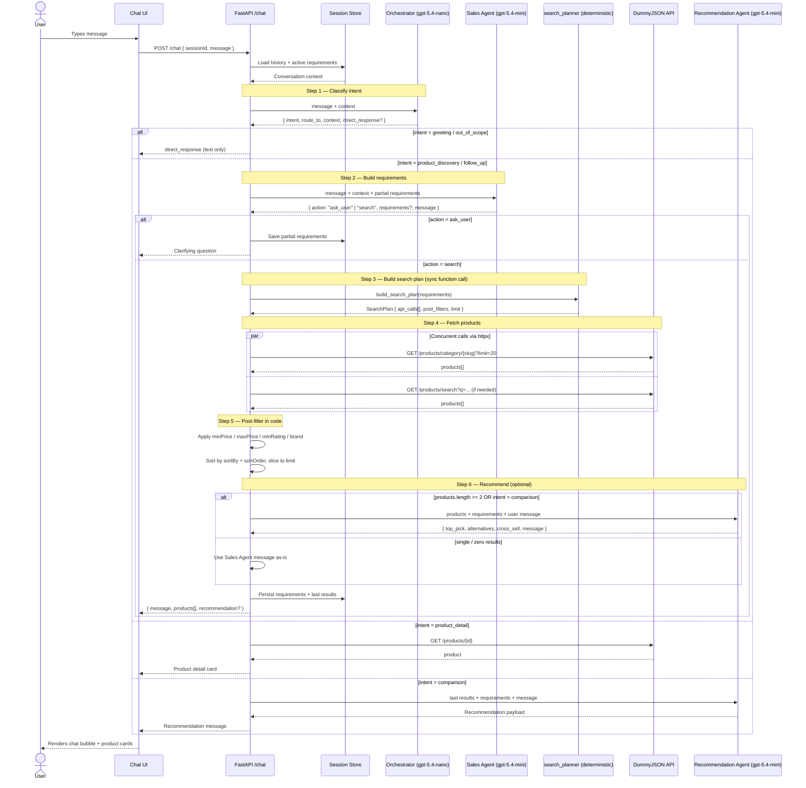

# Project System Design — AI Shopping Copilot Server

## Technology Stack

The server is a Python backend built around a multi-agent pipeline. The stack mirrors the `cv-creator` server so the same conventions, tooling, and deployment knowledge carry over.

| Layer | Choice | Why |
|---|---|---|
| Language / runtime | Python 3.12+ | Matches existing projects; great ecosystem for LLM work. |
| Web framework | **FastAPI** | Async-first, typed, automatic OpenAPI docs for the chat endpoint. |
| ASGI server | **uvicorn[standard]** | Standard FastAPI pairing, good local dev ergonomics. |
| Agent framework | **pydantic-ai** | Typed agents, structured outputs, works with OpenAI models (`gpt-5.4-mini`, `gpt-5.4-nano`). |
| Data models | **pydantic v2** | All agent I/O (requirements, search plan, recommendations) is validated through schemas. |
| Config | **pydantic-settings** + **python-dotenv** | `.env` for the OpenAI key and base URLs. |
| HTTP client | **httpx** (async) | Calls DummyJSON concurrently when the search plan contains multiple requests. |
| Logging | **structlog** | Structured logs per-turn (intent, agent, tokens, latency). |
| Testing | **pytest** + **pytest-asyncio** | Same test setup as cv-creator server. |

### Suggested folder layout (`server/src/`)

```
agents/          # orchestrator.py, sales.py, recommendation.py
api/             # FastAPI routers — /chat, /health
schemas/         # Pydantic models: Intent, Requirements, SearchPlan, Recommendation
services/        # dummyjson_client.py (httpx), search_planner.py, post_filters.py, session_store.py
core/            # agent pipeline glue, conversation state
middleware/      # request logging, error handling
config.py        # Settings (OpenAI key, model names, DummyJSON base URL)
main.py          # FastAPI app factory
```

---

## Sequence Diagram



---

## Explanation

The server exposes a single `POST /chat` endpoint. Each call runs a short pipeline whose shape depends on the user's intent:

1. **Orchestrator** (`gpt-5.4-nano`) is always the first hop. It is a cheap, fast router — it never answers product questions itself. It returns a typed `Intent` object that tells the API which agent (if any) to invoke next. Small-talk and out-of-scope messages short-circuit here with a `direct_response`.

2. **Sales Agent** (`gpt-5.4-mini`) is the "smart salesperson." It reads the conversation history plus any partial requirements stashed in the session store and decides whether to ask one more question or to emit a finalized `Requirements` object. This is the only agent with real conversational latitude; the others are structured workers.

3. **Search planner** (`services/search_planner.py`) is a **deterministic Python function** — `build_search_plan(requirements: Requirements) -> SearchPlan`. Because `Requirements` is already a fully-typed pydantic model, mapping it to a concrete `SearchPlan` (which DummyJSON endpoints to hit, which filters to apply in code because the API does not support them — `minPrice`, `maxPrice`, `minRating`, `brand`) is mechanical. An LLM here would add latency, cost, and nondeterminism without adding any capability the type system cannot already express. This drops the pipeline from 4 LLM calls to 3 per turn (Orchestrator → Sales → Recommendation).

4. **httpx client** executes the plan. When the plan contains multiple URLs (e.g., category + keyword fallback), they run concurrently via `asyncio.gather`.

5. **Post-filter service** applies price/rating/brand filters and the requested sort in pure Python. This is isolated in `services/post_filters.py` so it can be unit-tested without the LLM in the loop.

6. **Recommendation Agent** (`gpt-5.4-mini`) runs only when it adds value: 2+ results, an explicit comparison intent, or a user priority like `"quality"` or `"price"`. It returns a `top_pick`, `alternatives`, and an optional `cross_sell`, together with a short conversational message. For zero/one results, the Sales Agent's own message is used verbatim to save a model call.

7. **Session store** is defined as a `SessionStore` Protocol/ABC in `services/session_store.py` with `InMemorySessionStore` as the default implementation — a dict keyed by `sessionId`. It persists conversation history, the latest `Requirements`, and the last returned product list so follow-ups like *"what about jewelry instead?"* can refine an existing requirements object rather than starting over. The session store holds *state*, not cached results, so it is not a caching layer. The Protocol boundary means swapping to a Redis- or SQLite-backed store (needed before horizontal scaling — see **Deployment constraints** below) does not touch any call sites.

### Response contract

The `/chat` endpoint always returns:

```json
{
  "message": "<assistant text>",
  "products": [ /* DummyJSON product objects, possibly empty */ ],
  "recommendation": { "top_pick": {...}, "alternatives": [...], "cross_sell": "..." } // or null
}
```

The UI renders `products[]` as in-chat product cards and shows `recommendation.message` (if present) as a highlighted suggestion under the cards — satisfying the assignment's "in-chat product rendering" requirement without coupling the UI to any specific agent's wording.

### Cross-cutting concerns

- **Typed boundaries** — every agent input/output is a `pydantic` model in `schemas/`. The pipeline never passes raw dicts between agents.
- **Observability** — `structlog` emits one structured event per agent call with `session_id`, `intent`, `agent`, `model`, `latency_ms`, and `tokens`. Enough to debug flow issues from logs alone.
- **Failure isolation (honest accounting)** — not every component is isolated; some are hard dependencies. Specifically:
  - **Orchestrator failure** → log the failure and fall back to `intent = "product_discovery"` (safe default), then continue to Sales. The turn survives.
  - **Sales failure** → return a friendly error message to the user and end the turn. Sales is a **hard dependency**: without it there are no `Requirements`, and the pipeline cannot continue.
  - **DummyJSON failure (after retries exhausted)** → return an empty `products[]` alongside a Sales-style apology message. The turn survives.
  - **Recommendation failure** → return the products without a `recommendation` block and use the Sales Agent's message as the response text. The turn survives.
  - In short: only **DummyJSON** and **Recommendation** are truly isolated. **Sales** is a hard dependency; **Orchestrator** is soft-isolated via a default intent.
- **Cost control** — `gpt-5.4-nano` for the Orchestrator (high-frequency routing); `gpt-5.4-mini` only where conversational quality matters (Sales, Recommendation). The search planner is deterministic code, so it incurs zero model cost.

### Deployment constraints

- **Single-worker requirement** — the default `InMemorySessionStore` is a process-local dict. Running more than one uvicorn worker splits sessions across processes and produces inconsistent conversation state. **Deployment MUST run with a single uvicorn worker (`--workers 1`) OR swap the session store to a Redis- or SQLite-backed implementation before horizontal scaling.** This is a known limitation, explicitly chosen over adding infrastructure for the assignment scope.
- **Swap path** — because `SessionStore` is a Protocol in `services/session_store.py`, swapping to `RedisSessionStore` or `SqliteSessionStore` is a one-file change plus a config flag; no agent or API code changes.
- Note: the session store is **state**, not a cache. There is no caching layer in this system (no Redis response cache, no in-memory catalog cache, no HTTP cache).

### Reliability & Operations

- **Timeouts**
  - Every `httpx` call to DummyJSON is wrapped with `httpx.Timeout(connect=3.0, read=10.0, write=3.0, pool=3.0)`.
  - Every `pydantic-ai` agent call is wrapped in an overall per-turn budget (e.g., `asyncio.wait_for(pipeline(...), timeout=20.0)`) so a slow model cannot stall the request indefinitely.
- **Retries**
  - DummyJSON calls use `tenacity` with **2 retries, exponential backoff (0.5s, 2s)**, retrying **only on 5xx responses and network errors**. 4xx responses are never retried — they indicate a client-side issue that retries cannot fix.
  - LLM calls do **not** auto-retry. A structured-output failure (e.g., `pydantic` `ValidationError` raised by `pydantic-ai`) should surface, not be silently re-rolled.
- **Structured-output failure handling** — when `pydantic-ai` raises a `ValidationError` on an agent's output, the error is logged with `structlog` (including `session_id`, `agent`, raw output snippet) and the endpoint returns a graceful fallback message such as *"I hit a hiccup — could you rephrase?"*. The turn never crashes the process.
- **Intent classification eval plan** — the Orchestrator's accuracy is load-bearing (a wrong intent sends the turn down the wrong branch). An offline eval set of **20–50 labeled `(message, expected_intent)` pairs** lives at `tests/eval/intent_classification.jsonl` and is run via a dedicated pytest mark (`pytest -m eval`). The target is **≥90% accuracy**, and the eval **must be run before any Orchestrator prompt change** lands.
