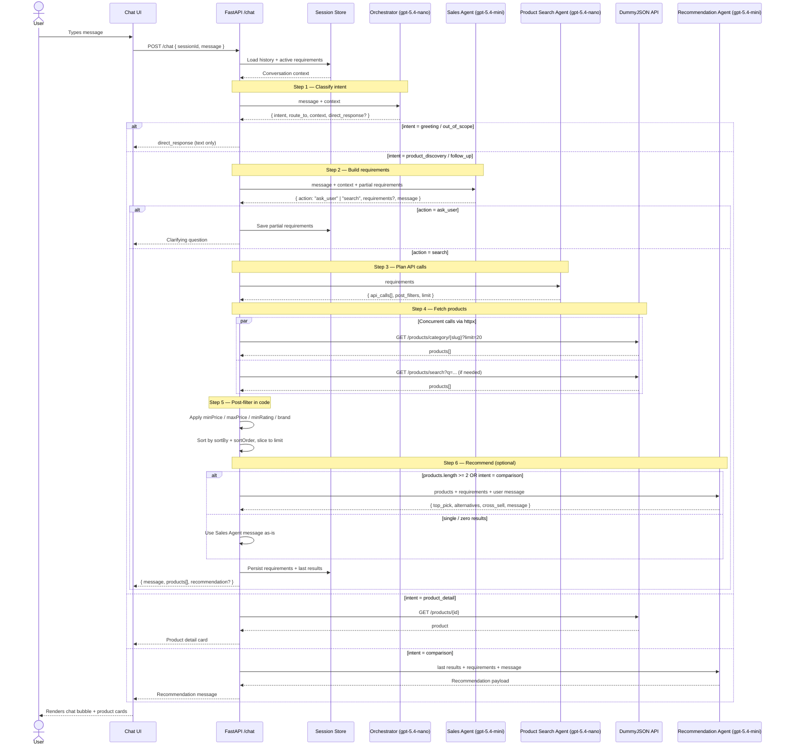

# Project System Design — AI Shopping Copilot Server

## Technology Stack

The server is a Python backend built around a multi-agent pipeline. The stack mirrors the `cv-creator` server so the same conventions, tooling, and deployment knowledge carry over.

| Layer | Choice | Why |
|---|---|---|
| Language / runtime | Python 3.12+ | Matches existing projects; great ecosystem for LLM work. |
| Web framework | **FastAPI** | Async-first, typed, automatic OpenAPI docs for the chat endpoint. |
| ASGI server | **uvicorn[standard]** | Standard FastAPI pairing, good local dev ergonomics. |
| Agent framework | **pydantic-ai** | Typed agents, structured outputs, works with OpenAI models (`gpt-5.4-mini`, `gpt-5.4-nano`). |
| Data models | **pydantic v2** | All agent I/O (requirements, search plan, recommendations) is validated through schemas. |
| Config | **pydantic-settings** + **python-dotenv** | `.env` for the OpenAI key and base URLs. |
| HTTP client | **httpx** (async) | Calls DummyJSON concurrently when the Search Agent issues multiple requests. |
| Logging | **structlog** | Structured logs per-turn (intent, agent, tokens, latency). |
| Testing | **pytest** + **pytest-asyncio** | Same test setup as cv-creator server. |

### Suggested folder layout (`server/src/`)

```
agents/          # orchestrator.py, sales.py, product_search.py, recommendation.py
api/             # FastAPI routers — /chat, /health
schemas/         # Pydantic models: Intent, Requirements, SearchPlan, Recommendation
services/        # dummyjson_client.py (httpx), post_filters.py, session_store.py
core/            # agent pipeline glue, conversation state
middleware/      # request logging, error handling
config.py        # Settings (OpenAI key, model names, DummyJSON base URL)
main.py          # FastAPI app factory
```

---

## Sequence Diagram



---

## Explanation

The server exposes a single `POST /chat` endpoint. Each call runs a short pipeline whose shape depends on the user's intent:

1. **Orchestrator** (`gpt-5.4-nano`) is always the first hop. It is a cheap, fast router — it never answers product questions itself. It returns a typed `Intent` object that tells the API which agent (if any) to invoke next. Small-talk and out-of-scope messages short-circuit here with a `direct_response`.

2. **Sales Agent** (`gpt-5.4-mini`) is the "smart salesperson." It reads the conversation history plus any partial requirements stashed in the session store and decides whether to ask one more question or to emit a finalized `Requirements` object. This is the only agent with real conversational latitude; the others are structured workers.

3. **Product Search Agent** (`gpt-5.4-nano`) translates `Requirements` into a concrete `SearchPlan`: which DummyJSON endpoints to hit, and which filters (`minPrice`, `maxPrice`, `minRating`, `brand`) must be applied in code because the API does not support them. Keeping this step as an LLM call (rather than hard-coded routing) lets the system adapt when the requirements mix category + keyword + brand in unusual ways.

4. **httpx client** executes the plan. When the plan contains multiple URLs (e.g., category + keyword fallback), they run concurrently via `asyncio.gather`.

5. **Post-filter service** applies price/rating/brand filters and the requested sort in pure Python. This is isolated in `services/post_filters.py` so it can be unit-tested without the LLM in the loop.

6. **Recommendation Agent** (`gpt-5.4-mini`) runs only when it adds value: 2+ results, an explicit comparison intent, or a user priority like `"quality"` or `"price"`. It returns a `top_pick`, `alternatives`, and an optional `cross_sell`, together with a short conversational message. For zero/one results, the Sales Agent's own message is used verbatim to save a model call.

7. **Session store** is an in-memory dict keyed by `sessionId` (swappable for Redis later). It persists conversation history, the latest `Requirements`, and the last returned product list so follow-ups like *"what about jewelry instead?"* can refine an existing requirements object rather than starting over.

### Response contract

The `/chat` endpoint always returns:

```json
{
  "message": "<assistant text>",
  "products": [ /* DummyJSON product objects, possibly empty */ ],
  "recommendation": { "top_pick": {...}, "alternatives": [...], "cross_sell": "..." } // or null
}
```

The UI renders `products[]` as in-chat product cards and shows `recommendation.message` (if present) as a highlighted suggestion under the cards — satisfying the assignment's "in-chat product rendering" requirement without coupling the UI to any specific agent's wording.

### Cross-cutting concerns

- **Typed boundaries** — every agent input/output is a `pydantic` model in `schemas/`. The pipeline never passes raw dicts between agents.
- **Observability** — `structlog` emits one structured event per agent call with `session_id`, `intent`, `agent`, `model`, `latency_ms`, and `tokens`. Enough to debug flow issues from logs alone.
- **Failure isolation** — if the Recommendation Agent fails, the endpoint still returns products + the Sales Agent's message. If DummyJSON fails, the Sales Agent apologizes and offers to retry. No single agent failure takes the whole turn down.
- **Cost control** — `nano` models for the router and search planner (high-frequency, structural tasks); `mini` models only where conversational quality matters (Sales, Recommendation).
