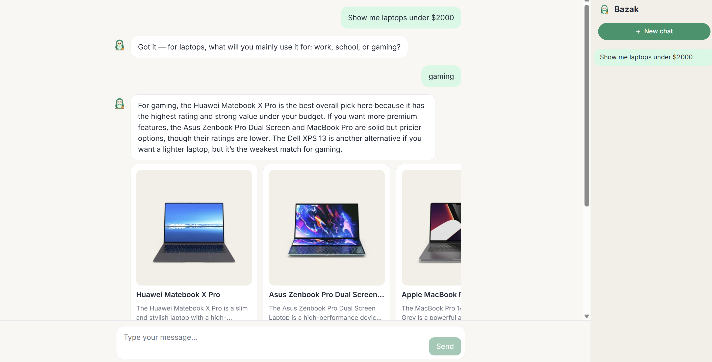

<p align="center">
  
</p>

<h1 align="center">Bazak — AI Shopping Copilot</h1>

A minimal conversational shopping copilot. The user chats naturally ("show me laptops under $500", "something for a gift, around 50 bucks"), the agent extracts intent, queries the [DummyJSON Products API](https://dummyjson.com/products) as the product catalog, and streams results back **rendered as an in-chat product widget** — title, short description, price, and image — not as plain text.

<p align="center">
  
</p>

---

## 1. Installation

**MUST:** create `server/.env` with your OpenAI key before starting anything. `.env` is gitignored (see [.gitignore](.gitignore)), so the key never ends up in the repo.

```bash
cp server/.env.example server/.env
# then edit server/.env and set:
# OPENAI_API_KEY=sk-...
```

### Option 1 — Docker (recommended)

Brings up both the server (`:8000`) and the client (`:3000`) with one command.

```bash
docker compose up --build
```

Then open [http://localhost:3000](http://localhost:3000) and try something like **"show me laptops under $500"** or **"I need a gift under $50"** to see the product widget render inline.

### Option 2 — Run locally

Run the server and the client in two separate terminals.

**Server** — see [server/README.md](server/README.md):

```bash
cd server
cp .env.example .env   # make sure OPENAI_API_KEY is set
uv sync
python -m uv run uvicorn src.main:app --host 127.0.0.1 --port 8000 --env-file .env
```

**Client** — see [client/README.md](client/README.md):

```bash
cd client
npm install
npm run dev   # http://localhost:3000, proxies /chat → http://localhost:8000
```

---

## 2. Technical choices

**Catalog** — [DummyJSON Products API](https://dummyjson.com/products) (no auth, rich filter/search params). The server wraps it behind a tool the agent can call with structured arguments extracted from the user's message.

**Server** — Python 3.12, [FastAPI](https://fastapi.tiangolo.com/) + Uvicorn, [pydantic-ai](https://ai.pydantic.dev/) for the agent loop and tool calling against OpenAI, Pydantic v2 for schemas, `structlog` for logging, `tenacity` for retries, `uv` for dependency management.

**Client** — Vite + React 18 + TypeScript, Tailwind CSS, Zustand for state, Vitest + Testing Library for tests. The dev server proxies `/chat` to the FastAPI backend. Product results are rendered as a dedicated widget component, not as markdown text — the LLM returns structured data, the UI owns presentation.

### Tradeoffs

- **pydantic-ai over LangChain / Mastra / Vercel AI SDK / CopilotKit.** The brief allowed any of these. I picked pydantic-ai because tool I/O is strongly typed via Pydantic models (the same schemas used at the HTTP boundary), which keeps the agent loop small and debuggable without the framework surface area of LangChain or the full-stack opinions of CopilotKit/Mastra. The cost is a smaller ecosystem of pre-built integrations — fine here, since there's exactly one tool.
- **Direct catalog retrieval, no RAG.** DummyJSON is ~100 products; a vector store would be overkill and hurt latency. See limitation #3 below for the production path.
- **Structured widget payload over markdown product cards.** Slightly more client code, but the UI stays in control of layout, images, and accessibility — and it's testable without parsing LLM output.
- **Same-origin proxy (nginx in Docker, Vite proxy in dev).** Avoids CORS config drift between environments. The client uses relative `/chat` URLs everywhere.

### Deeper design references

Architecture and folder trees live in [.design/](.design/):

- [.design/project-server-system-design.md](.design/project-server-system-design.md) — server architecture, endpoints, data flow.
- [.design/project-frontend-design.md](.design/project-frontend-design.md) — frontend structure and folder tree (source-of-truth).
- [.design/agents-structure.md](.design/agents-structure.md) — agent / tool composition.

---

## 3. Assumptions and limitations

1. **Model whitelist is `gpt-5.4-mini` and `gpt-5.4-nano` only** — per the assignment brief. If a reviewer wants to try other models, they can be swapped in and compared side-by-side against these two, but the current configuration is intentionally locked to this pair.
2. **No automated eval harness yet.** In a real production project I would add an `eval` command: a Claude-driven script with a fixed set of use cases (known inputs → expected outputs), driven end-to-end through Playwright against the running app, producing a pass/fail report at the end. That is the right shape for regression-proofing an LLM product, and it is out of scope for this assignment.
3. **Retrieval backend is intentionally simple.** The agent calls DummyJSON's built-in search/filter endpoints directly. For a production catalog I would keep the LLM-extracts-filters-then-calls-a-tool shape (it scales), but replace DummyJSON with a real search stack — Elasticsearch / OpenSearch or a managed equivalent (Algolia, Typesense) — doing lexical search + faceted filters on structured attributes, with embeddings used as a re-ranker for long-tail / semantic queries rather than as the primary index. Pure RAG over product blobs is the wrong shape for ecommerce: hard filters (`price < X`, `in_stock`) and ranking signals (popularity, conversion) matter more than vector similarity.
